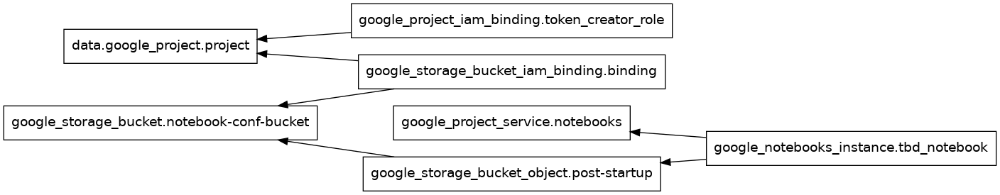
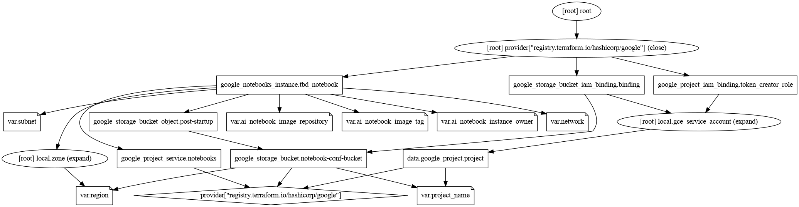
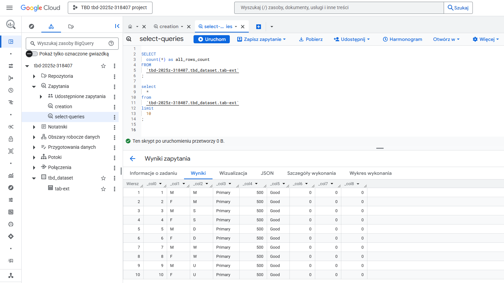

IMPORTANT ❗ ❗ ❗ Please remember to destroy all the resources after each work session. You can recreate infrastructure by creating new PR and merging it to master.


1. Authors:

   Group: z4

   Repo: [link](https://github.com/mikic202/tbd-workshop-1-2025Z)

2. Follow all steps in README.md.

3. From avaialble Github Actions select and run destroy on main branch.

4. Create new git branch and:
    1. Modify tasks-phase1.md file.

    2. Create PR from this branch to **YOUR** master and merge it to make new release.

    <!-- ***place the screenshot from GA after succesfull application of release*** -->

    

    


5. Analyze terraform code. Play with terraform plan, terraform graph to investigate different modules.

    <!-- ***describe one selected module and put the output of terraform graph for this module here*** -->
    We decided to investigate the vertex-ai-workbench module.

    * Graphs:

    ```
    cd modules/vertex-ai-workbench
    terraform init
    ```

    `terraform graph | dot -Tpng > ../../doc/screenshots/graph_small.png`

    

    `terraform graph -type=plan | dot -Tpng >  ../../doc/screenshots/graph.png`

    

    * Descripiton

        The smaller graph shows only nodes with datasources and their relations, dependencies. These are the essencials of the infrastructure objects. Plan graph includes also the variables, providers and other resources as well. Its everything that Terraform uses when planning.

        The Vertex-ai-workbench module provides a Google Cloud Vertex AI Workbench Notebook Instance. The module automates the setup of Vertex instance and enables configuration such as project_name, region, network, subnet. This Instance is a managable Jupyter enviroment for data science and machine learning.

        Main resources:

        1. Google Notebook Instance (`google_notebooks_instance.tbd_notebook`) - managed notebook instance.

        2. Google Project Service (`google_project_service.notebooks`) - the service that ensures that the Nootebooks APIs are enabled in the project. It's a prerequisite for creattion of notebook instance.

        3. Google Cloud Storage Bucket (`google_storage_bucket.notebook-conf-bucket`and `oogle_storage_bucket_object.post-startup`) - Creation of the GCP Buckets for storing operational data - configuration files, startup scripts, etc.

        4. IAM binding (`google_storage_bucket_iam_binding.binding` and `google_project_iam_binding.token_creator_role`) - a authorisation, permission and policy management tool.

        5. Google Cloud Data Source (`data.google_project.project`) - retrieval of project metadata.


6. Reach YARN UI

   ***place the command you used for setting up the tunnel, the port and the screenshot of YARN UI here***


7. Draw an architecture diagram (e.g. in draw.io) that includes:
    1. Description of the components of service accounts
    2. List of buckets for disposal

    ***place your diagram here***

8. Create a new PR and add costs by entering the expected consumption into Infracost
For all the resources of type: `google_artifact_registry`, `google_storage_bucket`, `google_service_networking_connection`
create a sample usage profiles and add it to the Infracost task in CI/CD pipeline. Usage file [example](https://github.com/infracost/infracost/blob/master/infracost-usage-example.yml)

   ***place the expected consumption you entered here***

   ***place the screenshot from infracost output here***

9. Create a BigQuery dataset and an external table using SQL

    ORC file was downloaded from:
    
    <https://github.com/apache/orc/blob/main/examples/TestOrcFile.test1.orc>

    ```
    CREATE SCHEMA IF NOT EXISTS `tbd-2025z-318407.tbd_dataset`
    OPTIONS (
    location = 'europe-west1'
    );

    CREATE EXTERNAL TABLE IF NOT EXISTS `tbd-2025z-318407.tbd_dataset.tab-ext`
    OPTIONS (
    format = 'ORC',
    uris = ['gs://tbd-2025z-318407-data/data/*.orc']
    );
    ```

    Sample query from created table:

    


    <!-- ***why does ORC not require a table schema?*** -->
    ORC file type does not require any table schema because it is self-describing. It stores metadata such as column names, data types and structure so reader in bigquery can apply ORC file automatically.


10. Find and correct the error in spark-job.py

    ***describe the cause and how to find the error***

11. Add support for preemptible/spot instances in a Dataproc cluster

    ***place the link to the modified file and inserted terraform code***

12. Triggered Terraform Destroy on Schedule or After PR Merge. Goal: make sure we never forget to clean up resources and burn money.

Add a new GitHub Actions workflow that:
  1. runs terraform destroy -auto-approve
  2. triggers automatically:
 
   a) on a fixed schedule (e.g. every day at 20:00 UTC)
 
   b) when a PR is merged to main containing [CLEANUP] tag in title

Steps:
  1. Create file .github/workflows/auto-destroy.yml
  2. Configure it to authenticate and destroy Terraform resources
  3. Test the trigger (schedule or cleanup-tagged PR)

***paste workflow YAML here***

***paste screenshot/log snippet confirming the auto-destroy ran***

***write one sentence why scheduling cleanup helps in this workshop***
